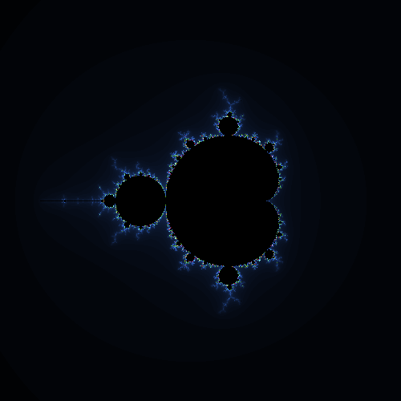

# fractal.php

🐍🐍🐍 PHPのGDライブラリを使用してフラクタル図形を描写する。  

## 成果物イロイロ

### マンデルブロ集合

  

### ジュリア集合

  

### トライコーン集合

  

### バーニングシップ集合

  

## 実行方法

```shell
docker build -t fractal-php . && docker run -p 80:80 -it --rm --name my-fractal-php fractal-php
```

<http://localhost:80>へアクセス。  
80番ポートをリッスンしたくない場合には、ホスト側のポートを変えてください。  
